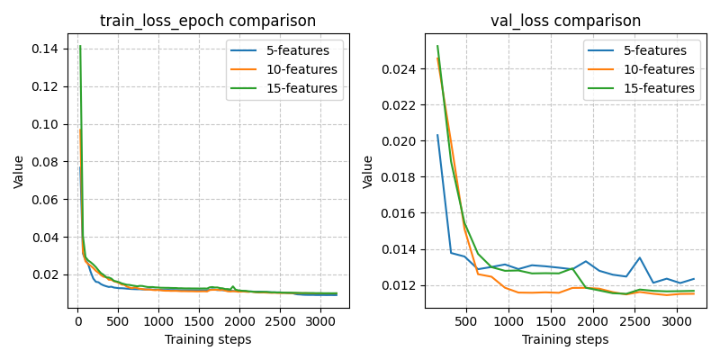
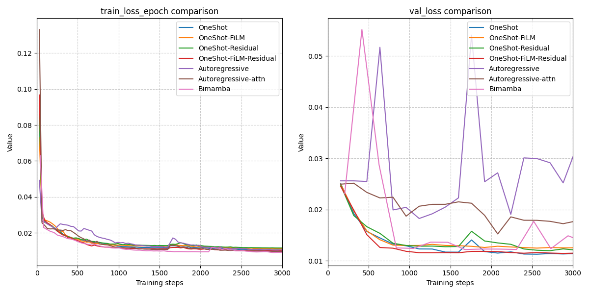
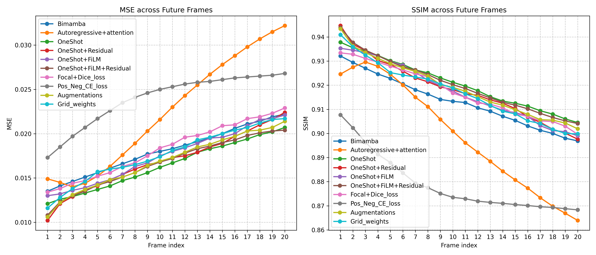
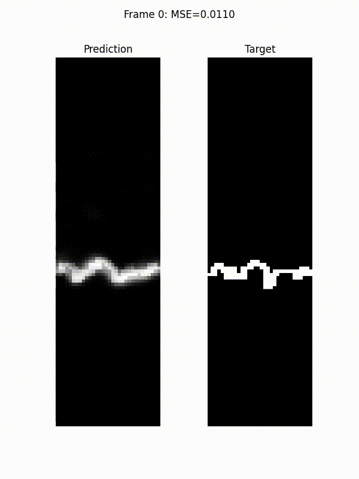
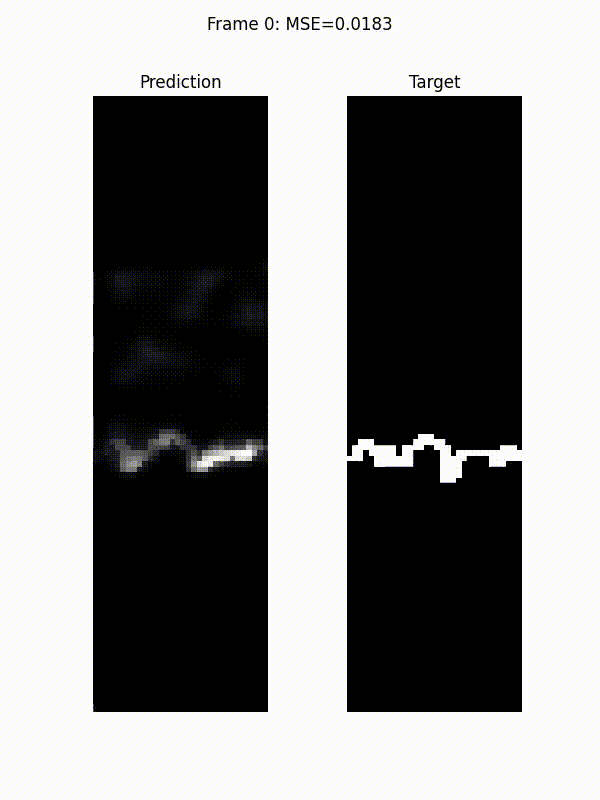

# Spatio-Temporal Fire Propagation

This project implements machine learning models to predict spatio-temporal fire propagation over inclined plane. The models take spatial and dynamic features over time as input, and output a spatio-temporal prediction of fire spread. This project experiments with several deep learning architectures, loss functions, data sampling and augmentations techniques.

## Dataset

The models are trained on the dataset released at the **Stanford FLAME AI Workshop 2024**:  
[https://www.kaggle.com/competitions/2024-flame-ai-challenge/data](https://www.kaggle.com/competitions/2024-flame-ai-challenge/data)

The dataset consists of 9 wildfire simulation videos, each containing 150 frames.
For each frame, two categories of attributes are provided:

| Category | Features |
|---|---|
| **Dynamic** (per-frame) | Velocity fields, temperature maps, fire fronts |
| **Static** (time-invariant) | Terrain slope, wind speed |

The simulations are based on the FireBench framework. For full details of the simulation setup, refer to the following paper:  
[https://sites.research.google/gr/wildfires/firebench/](https://sites.research.google/gr/wildfires/firebench/)

Task formulation: Given 5 consecutive input frames, predict the next 20 frames of fire front propagation.

## Models

Three model families are implemented, all operating on spatial feature maps across time:

### 1. DirectRegressor (OneShot)

An encoder-decoder architecture built around **ConvLSTM** cell. The model encodes all input frames in a single forward pass and directly predicts the full set of future frames at once (**one-shot prediction**). 

Variants explored:
- **OneShot**: Base model.
- **OneShot-FiLM**: Adds Feature-wise Linear Modulation (FiLM) layers to condition dynamic
  features on the static context (slope, wind speed).
- **OneShot-Residual**: Predicts the residual fire front change on top of the last input
  frame, rather than the absolute future frames.
- **OneShot-FiLM-Residual**: Combines FiLM conditioning with residual prediction.

### 2. Seq2Seq (Autoregressive)

A sequence-to-sequence model using **ConvLSTM** cells that predicts future frames autoregressively. Each predicted frame is fed back as input to generate the next.

Variants explored:
- **Autoregressive**: Base Seq2Seq model.
- **Autoregressive-Attention**: Adds a self-attention module along with ConvLSTM cell, allowing
  the model to focus on the most important spatial regions over long time horizon.

### 3. BiMamba

A **bidirectional Mamba-based** (state space model) architecture that processes the
input sequence in both temporal directions before decoding the full prediction in one shot.

---

## Feature Engineering

Beyond the five raw input features, the following derived features were computed to provide
the model with richer physical signal:

| Feature | Formula / Description |
|---|---|
| `vertical_velocity` | (velocities - (wind_speed × cos(slope))) / sin(slope) |
| `horizontal_velocity` | wind_speed × cos(slope) |
| `ff_cumsum` | Cumulative sum of fire front maps across time |
| `diff_temp` | Frame-to-frame temperature difference map |
| `diff_vel` | Frame-to-frame velocity difference map |
| `ff_vx` | Spatial velocity component in the x-direction |
| `ff_vy` | Spatial velocity component in the y-direction |
| `sdf` | Signed Distance Function of the fire front boundary |
| `ros_mag` | Rate of spread magnitude: sqrt(vx^2+vy^2) |
| `curvature` | Front curvature: K = div(∇φ / norm(∇φ))  |

Three feature groups were ablated:

| Group | Features |
|---|---|
| **5-features** | `wind_speed`, `terrain_slope`, `temperatures`, `velocities`, `firefronts` |
| **10-features** | 5-features + `vertical_velocity`, `horizontal_velocity`, `ff_cumsum`, `diff_temp`, `diff_vel` |
| **15-features** | 10-features + `ff_vx`, `ff_vy`, `sdf`, `ros_mag`, `curvature` |

The 10-feature model yields the lowest validation loss. Adding the remaining five features
does not improve performance, likely because curvature and SDF introduce redundancy or require
more data to be leveraged effectively.

**Loss comparison for different feature groups:**



## Results and Visualizations

### Architecture Comparison

Seven configurations were compared in a ablation study:

| # | Model | Description |
|---|---|---|
| 1 | **OneShot** | DirectRegressor: one-shot ConvLSTM encoder-decoder |
| 2 | **OneShot-FiLM** | OneShot + FiLM conditioning of dynamic features on static context |
| 3 | **OneShot-Residual** | OneShot predicting residual fire front on top of last input frame |
| 4 | **OneShot-FiLM-Residual** | Combines FiLM conditioning (2) and residual prediction (3) |
| 5 | **Autoregressive** | Seq2Seq ConvLSTM predicting frames consecutively |
| 6 | **Autoregressive-Attention** | Autoregressive model (5) with self-attention |
| 7 | **BiMamba** | Bidirectional Mamba, one-shot prediction |

**Results:**

- The **base OneShot model** achieves the lowest validation loss overall.
- **Mamba architectures** are over-parameterised for this dataset size, leading to overfitting and higher validation loss.
- **Autoregressive ConvLSTM** performs poorly due to cumulative error accumulation over the 20-step rollout horizon.
- Adding **self-attention** to the autoregressive model recovers performance, suggesting attention helps the decoder to correct drift.
- **FiLM conditioning** and **residual prediction** do not improve upon the base OneShot model, indicating that the ConvLSTM encoder already captures sufficient static-dynamic interactions implicitly.

**Training and validation loss comparison:**



---

### Loss Function and Augmentation Experiments

Additional experiments were run on top of the best-performing OneShot model:

1. **Focal Cross-Entropy + Dice loss**: Addresses class imbalance between fire and non-fire pixels.
2. **Positive-Negative Cross-Entropy loss**: Separately weights false positives and false negatives.
3. **Augmentations**L Blur, Gaussian noise, horizontal flip, and horizontal roll applied during training.
4. **Grid weighting**: Upweights loss on differential cells (pixels that change between successive time frames).

**Per-frame Metrics (MSE and SSIM, frames 1–20):**



The OneShot model produces the lowest MSE and highest SSIM across all 20 predicted frames,
confirming its robustness for this task and dataset size. Surprisingly, cross entropy based losses are not helpful over mse loss. Even augmentations are deterioting model performance. Since, this task involves high sparsity in instance segmentation problem (around 30-40 positive pixels in whole 113*32 grid), model relys heavily on capturing fine grained variations in the input velocity and temperature fields. Thus, artificial augmentations actually disturbs this physics. One can try to train model in multi task learning setup, to predict future temperature, velocity fields, and cropped regions to force the model to focus more on complex details.  

---

### Inference Animations

The animations below show predicted fire propagation for 20 future frames, conditioned on 5 input frames, for three model variants:

| **BiMamba** | **Autoregressive + Attention** | **OneShot FiLM Residual** |
|---|---|---|
|  |  |  |

---

---

## Training

To train a model, run `main.py` with the `--train` flag

```bash
python project/main.py configs/training_setup.yaml --train --logs logs/my_experiment/
```

Setup training parameters in `configs/training_setup.yaml`).
Logs and intermediate checkpoints are saved to the directory specified by `--logs`.

---

## Evaluation

The evaluation pipeline supports three modes, configured in `configs/eval_setup.yaml`:

| Mode | Description |
|---|---|
| `Inference` | Run the model on new data and save predictions |
| `Regular` | Evaluate model on a held-out set with one-shot prediction |
| `Autoregressive` | Evaluate with frame-by-frame autoregressive rollout |

To evaluate a trained checkpoint:

```bash
python project/main.py configs/eval_setup.yaml \
    --eval \
    --checkpoint_file logs/my_experiment/model-epoch=99.ckpt \
    --logs logs/eval_output/
```

Evaluation outputs include per-frame MSE and SSIM metrics, saved to the specified
`--logs` directory.

---

## References

- FireBench simulation dataset:  
  [https://sites.research.google/gr/wildfires/firebench/](https://sites.research.google/gr/wildfires/firebench/)

- Zhihui, L. et al. *Self-Attention ConvLSTM for Spatiotemporal Prediction*, NeurIPS 2015.

- Sukjung, H. et al. *Hydra: Bidirectional State Space Models Through Generalized Matrix Mixers*, 2024.

- Perez, E. et al. *FiLM: Visual Reasoning with a General Conditioning Layer*, AAAI 2018.
